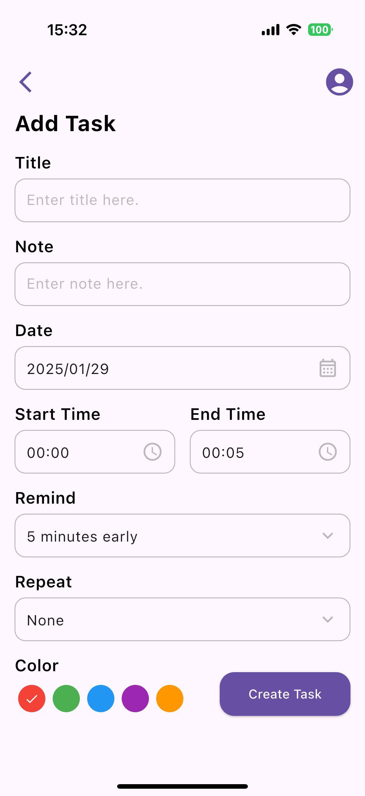

# mycalc

My Calendar

## About App

### Home(Empty)

    
    

### Home

### Add Task Page

## Reason for writing this app
1. Learn how to create layouts in Flutter.
2. Study how a Flutter app runs and how its lifecycle works.
3. Try calling an operating system’s native library using Flutter code.
4. Get familiar with commonly used libraries in Flutter and Dart.