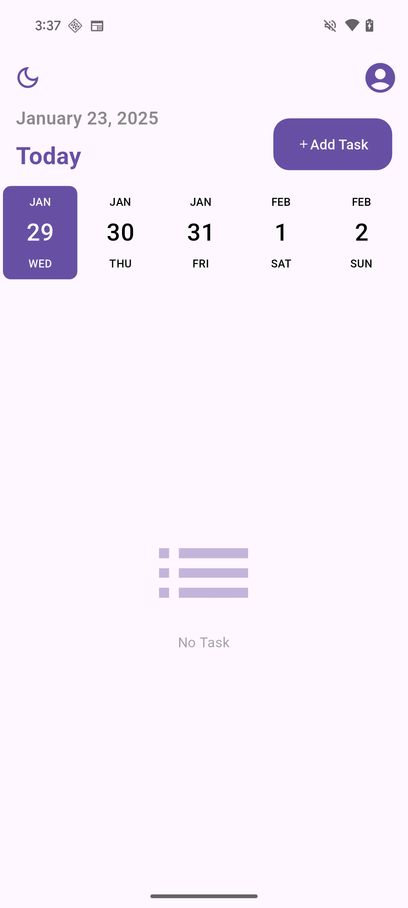
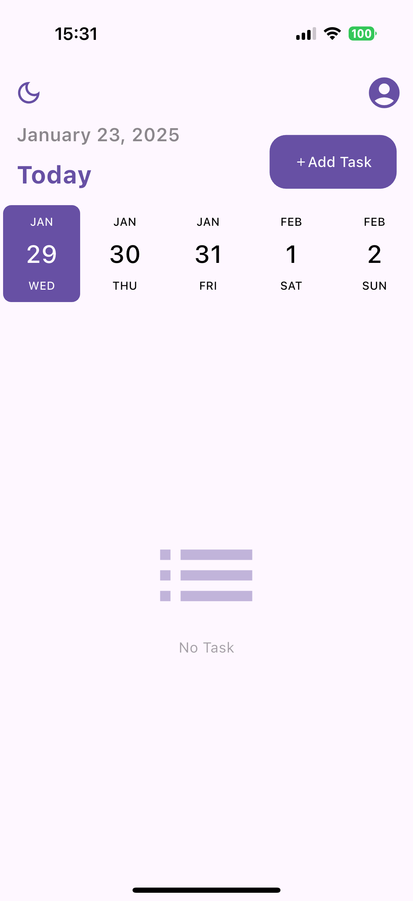
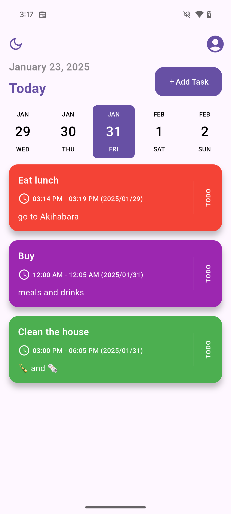
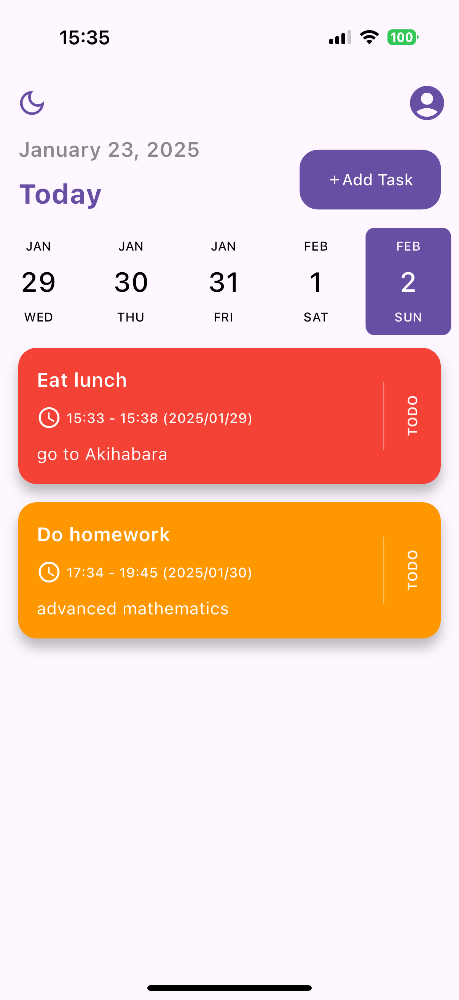
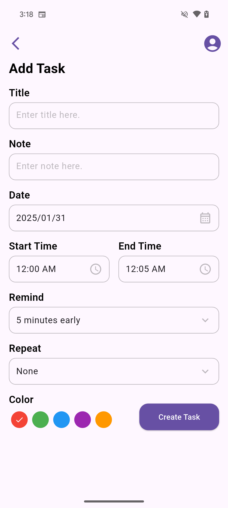
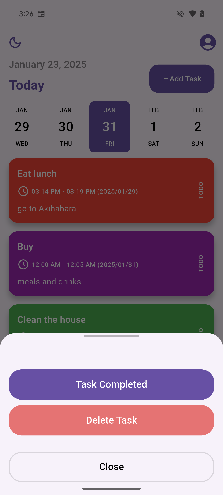

# mycalc

My Calendar

## About App

### Screenshot on Android devices

    <tr>
        
         Android 
    </tr>
    <tr>
        
         iOS 
    </tr>

## Reason for writing this app
1. Learn how to create layouts in Flutter.
2. Study how a Flutter app runs and how its lifecycle works.
3. Try calling an operating system’s native library using Flutter code.
4. Get familiar with commonly used libraries in Flutter and Dart.